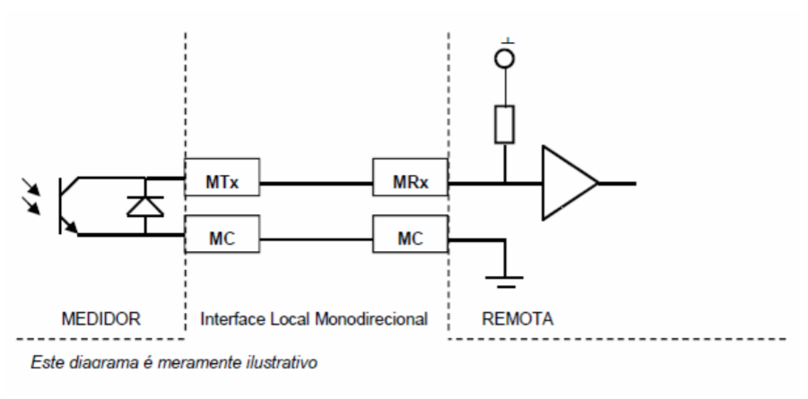

# Unidirectional Asynchronous Serial Output (PIMA)

The Unidirectional Asynchronous Serial Output is a protocol to
communication with electronic electricity meters. 

## Diagram

## Serial Configuration

Each meter has a fixed rate, usually 2400 Baud rate.

## Packet Format

| Preamble | Id | Size | Index | Data | CRC |
| :-------: | :-----------: | :-----: | :-------------: | :---: | :-: |
| 2 bytes | 5 bytes | 1 byte | 2 bytes | n bytes | 2 bytes |

## Standard Packages

| Index | Type | 
| :-: | :-: |
| 0x0A02 | ACTIVE |
| 0x0A07 | INDUCTIVE |
| 0x0A0C | CAPACITIVE |
| 0x0A51 | REVERSE |

### Documentation

Here a [Celesc](assets/E-321.0017-SAIDA-SERIAL-ASSINCRONA-UNIDIRECIONAL.pdf) manual in Portuguese whos explains how the PIMA communication works.

---

## Installation

* Install the library by [Using the Library Manager](https://www.arduino.cc/en/Guide/Libraries#toc3)
* **OR** by [Importing the .zip library](https://www.arduino.cc/en/Guide/Libraries#toc4) using either the [master](https://github.com/ricaun/arduino-PIMA/archive/1.0.0.zip) or one of the [releases](https://github.com/ricaun/arduino-PIMA/releases) ZIP files.

## Examples

The library comes with [examples](examples). After installing the library you need to restart the Arduino IDE before they can be found under **File > Examples > PIMA**.

## API

See [API.md](API.md).

## License

This library is [licensed](LICENSE) under the [MIT Licence](https://en.wikipedia.org/wiki/MIT_License).

---

Do you like this library? Please [star this project on GitHub](https://github.com/ricaun/arduino-PIMA/stargazers)!